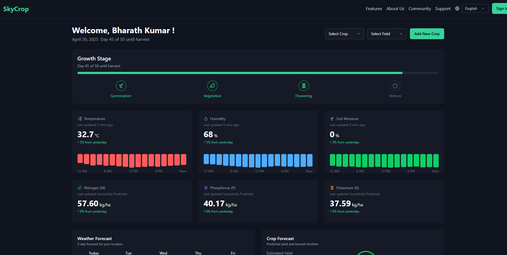

# SkyCrop - Smart Farming Solutions



## Introduction

SkyCrop is a smart and convinient farming solution designed to empower farmers with data-driven insights and intelligent tools for optimizing crop health, managing resources, and improving yields. It provides real-time crop monitoring, Pest and disease detection, and an AI-powered farm management assistant.

## Features

*   **Real-time Crop Monitoring:** SkyCrop uses advanced image recognition to monitor your crops remotely, providing data-driven insights about crop health, growth stages, and potential risks. 
*   **Pest Detection:** Identify and classify common pests affecting your crops using our AI-powered pest detection system. Get early warnings and recommended actions to prevent infestations. 
*   **Disease Prediction:** Detect potential diseases early by analyzing leaf patterns and discoloration. Receive timely alerts and guidance to mitigate disease outbreaks. 
*   **Farm Management Assistant (AgriCare):** AgriCare is an AI-powered assistant that provides personalized farm management guidance, optimizing resource usage and improving crop yields through intelligent recommendations and monitoring. 
*   **Sensor Dashboard:** Monitor key environmental factors such as temperature, humidity, and soil moisture in real-time with our integrated sensor dashboard. 

## Technologies Used

*   [React](https://react.dev/)
*   [TypeScript](https://www.typescriptlang.org/)
*   [Vite](https://vitejs.dev/)
*   [Tailwind CSS](https://tailwindcss.com/)
*   [shadcn-ui](https://ui.shadcn.com/)
*   [ONNX Runtime Web](https://onnxruntime.ai/docs/api/js/)
*   [Firebase](https://firebase.google.com/)

## Setup Instructions

Follow these steps to set up the project locally:

1.  **Clone the repository:**

    ```sh
    git clone https://github.com/BrhKmr23/SkyCrop-Main
    ```

2.  **Navigate to the project directory:**

    ```sh
    cd SkyCrop-Main
    ```

3.  **Install the necessary dependencies:**

    ```sh
    npm install
    ```

4.  **Configure Firebase:**

    *   Create a Firebase project on the [Firebase Console](https://console.firebase.google.com/).
    *   Enable the Realtime Database.
    *   Copy your Firebase configuration object and replace the placeholder in `src/lib/firebase.ts`.

5.  **Run the development server:**

    ```sh
    npm run dev
    ```

    This will start the development server with auto-reloading and an instant preview at `http://localhost:5173`.

## Usage

*   **Uploading Images for Analysis:**
    *   Navigate to the AgriVision page.
    *   Click the "Upload Image" button.
    *   Select an image of your crop.
    *   The system will analyze the image and display the results.

*   **Interacting with the AgriCare Assistant:**
    *   Navigate to the AgriCare page.
    *   Type your question in the input field.
    *   Click the "Send" button to submit your question.
    *   The Llama AI assistant will provide a response.

*   **Viewing Sensor Data on the Dashboard:**
    *   Navigate to the main dashboard page.
    *   The sensor data (temperature, humidity, soil moisture, NPK values) will be displayed in real-time.

## Model Details

AgriVision uses ONNX models for pest detection and nutrient prediction.

*   **Pest Detection Model:**
    *   **Input:** Image data (224x224 pixels, NCHW format).
    *   **Output:** A tensor of shape `[1, 9, 1029]` containing bounding box coordinates, confidence scores, and class probabilities for each potential detection.
    *   **Labels:** The `public/models/pest_detection_labels.yaml` file maps class indices to pest names.

*   **Nutrient Prediction Models (Nitrogen, Phosphorus, Potassium):**
    *   **Input:** Temperature, humidity, and soil moisture values.
    *   **Output:** Predicted nutrient levels (kg/ha).

## Contributing

We welcome contributions to AgriVision! Please follow these guidelines:

*   Fork the repository.
*   Create a new branch for your feature or bug fix.
*   Submit a pull request with a clear description of your changes.

## License

MIT License
